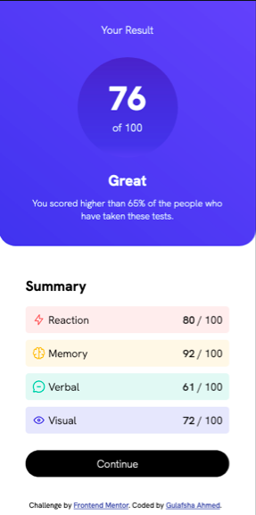

# Frontend Mentor - Results summary component solution

This is a solution to the [Results summary component challenge on Frontend Mentor](https://www.frontendmentor.io/challenges/results-summary-component-CE_K6s0maV). Frontend Mentor challenges help you improve your coding skills by building realistic projects. 

## Table of contents

- [Overview](#overview)
  - [The challenge](#the-challenge)
  - [Screenshot](#screenshot)
  - [Links](#links)
- [My process](#my-process)
  - [Built with](#built-with)
  - [What I learned](#what-i-learned)
  - [Useful resources](#useful-resources)
- [Author](#author)

## Overview

### The challenge

Users should be able to:

- View the optimal layout for the interface depending on their device's screen size
- See hover and focus states for all interactive elements on the page

### Screenshot

### Links

- Solution URL: [Github solution URL](https://github.com/pyjamaSamm/frontendMentor_I.git)
- Live Site URL: [live site URL](https://pyjamasamm.github.io/frontendMentor_I/)

## My process

### Built with

- Semantic HTML5 markup
- CSS custom properties
- Flexbox
- CSS Grid
- Mobile-first workflow

### What I learned

In this project, I've implemented several HTML and CSS techniques to create a visually appealing component. Some of the key techniques I learned and applied include:

* Proper structuring of HTML elements using tags like div, span, svg, and path.
* Utilization of CSS classes and IDs for targeted styling.
* Implementation of flexbox for flexible and responsive layouts.
* Effective use of positioning, such as margin, padding, and position, to achieve desired element placement.
* Styling elements using various CSS properties like background-color, border-radius, box-shadow, color, font-size, font-weight, and text-align.
* Customizing the visual appearance with linear gradients for background colors.
* Media queries to adapt the layout and styles for different screen sizes.

These techniques allowed me to create an engaging and well-designed component. By exploring and implementing these HTML and CSS features, I have gained valuable knowledge in layout design, responsive development, and the use of custom fonts. Feel free to explore the code and customize it according to your requirements.

### Useful resources

- [W3Schools](https://www.w3schools.com/)
- [MDN Web Docs](https://developer.mozilla.org/en-US/)

## Author

- Website - [Gulafsha Ahmed](https://www.your-site.com)
- Frontend Mentor - [@pyjamaSamm](https://www.frontendmentor.io/profile/pyjamaSamm)

